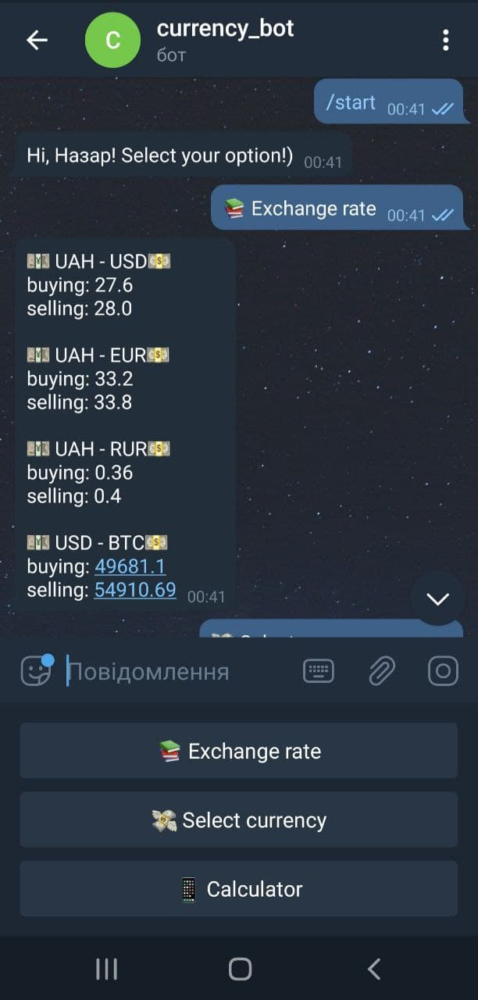
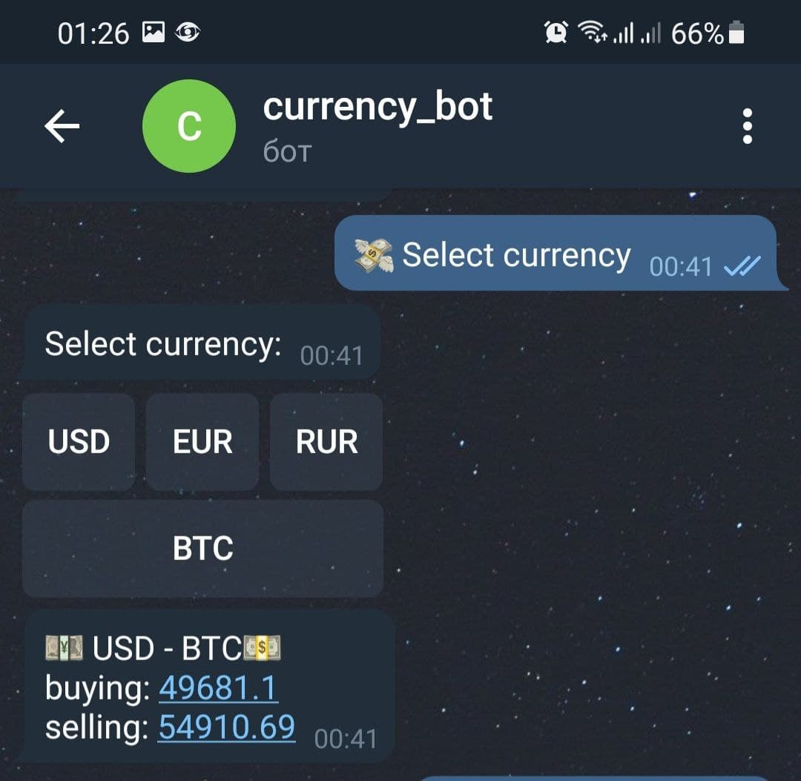
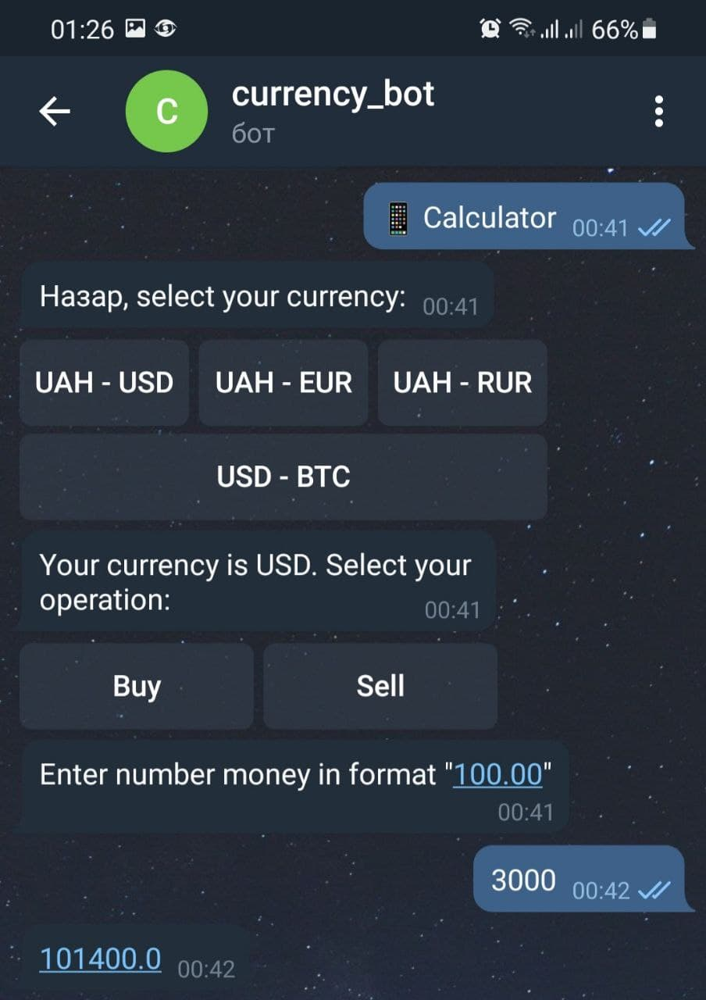

# Currency_privat_bot
It's a currency bot. This `telegram bot` converts the most popular currencies. 
User can get and look through all currency values from exchange rate, get required value and to use a calculator. 
All converted values are getting from [PrivatBank API](https://api.privatbank.ua/#p24/exchange).
  

## Options
___
User can use each from this options and see result:
1. Exchange rate (all values)
1. Select currency (required value)
1. Calculator (calculate currenciy with user's values)

 

 

 

 

